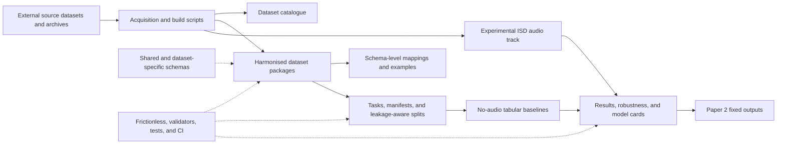

# MOSAIQ — Multimodal Open Soundscape AI Quality-benchmark

MOSAIQ is a versioned benchmark infrastructure for soundscape AI research. It
harmonises records from ISD, ARAUS, SATP, and DeLTA under shared schemas and
publishes task contracts, leakage-aware splits, frozen manifests, validators,
reproducible baselines, uncertainty analyses, and model/data cards.

The current `0.1.0-dev` candidate is intentionally **no-audio and tabular**.
Audio and visual assets are referenced through provenance fields but are not
distributed or consumed by the current models. It must not be described as the
final multimodal MOSAIQ-v1.0 release.

An experimental ISD audio track is maintained separately under
[`benchmark/audio/`](benchmark/audio/). Seven benchmark-candidate archives are
verified and the frozen `0.1.0-audio` cohort contains 820 trainable clips.
Committed outputs include technical QC, deterministic descriptors, clip- and
response-level Target Mean/Ridge results, cluster-bootstrap intervals, and
model cards. Raw WAV files remain outside Git. This does not change the frozen
no-audio Paper 2 outputs or constitute the final multimodal benchmark.

## Repository structure



```text
MOSAIQ/
|-- catalogue/          # dataset-level inventory and schema
|-- datasets/           # ISD, ARAUS, SATP, and DeLTA packages
|-- shared_schemas/     # reusable Frictionless and harmonisation contracts
|-- mappings/           # explicit source-to-MOSAIQ semantic mappings
|-- examples/           # harmonised ISD and ARAUS sample records
|-- benchmark/          # tasks, splits, manifests, baselines, and validation
|   |-- audio/          # separate experimental ISD audio track
|   |-- data_cards/     # benchmark and source-dataset documentation
|   |-- governance/     # licence, consent, and attribution records
|   |-- results/        # frozen no-audio predictions and metrics
|   `-- robustness/     # multi-seed and uncertainty analyses
|-- papers/             # fixed manuscript tables, figures, and evidence
|-- docs/               # reproduction, feature, release, and audit notes
|-- scripts/            # acquisition, build, evaluation, and validation tools
|-- tests/              # unit and contract tests
|-- notebooks/          # exploratory and generated analysis notebooks
`-- config/             # optional feature configuration such as CitySeg classes
```

The detailed component and validation audit is in
[`docs/repository_audit.md`](docs/repository_audit.md).

## Quick start

This project uses [uv](https://github.com/astral-sh/uv) for environment and
dependency management.

### 1. Install uv

```bash
curl -LsSf https://astral.sh/uv/install.sh | sh
```

### 2. Sync the environment

From the repository root:

```bash
uv sync
```

This creates a `.venv/` in the project directory and installs all
dependencies pinned in `uv.lock`.

### 3. Validate the data package

```bash
uv run frictionless validate catalogue/datapackage.yaml
uv run frictionless validate datasets/ISD/datapackage.yaml --trusted
uv run frictionless validate datasets/ARAUS/datapackage.yaml --trusted
uv run frictionless validate datasets/SATP/datapackage.yaml
uv run frictionless validate datasets/DeLTA/datapackage.yaml
```

Expected output: catalogue resources (`datasets`) and dataset package
resources (`clips`, `responses`, optional `features`) all reporting `VALID`.
(`--trusted` is used for dataset packages because the shared feature schema is
referenced via a parent-relative path.)

Validate the draft benchmark task registry and its source-column contracts:

```bash
uv run python scripts/validate_benchmark_tasks.py
uv run python scripts/validate_benchmark_splits.py
uv run python scripts/build_benchmark_report.py --check-only
```

See [`benchmark/README.md`](benchmark/README.md) for the seven MOSAIQ v0.1
clip- and response-level tasks, candidate dataset freeze, technical-validation
outputs, and executed audio-free tabular baselines. To regenerate the complete
freeze and baseline outputs, run:

```bash
uv run python scripts/build_benchmark_report.py
uv run python scripts/run_tabular_baselines.py
uv run python scripts/build_model_cards.py
uv run python scripts/validate_tabular_baselines.py
uv run python scripts/run_robustness_evaluation.py
uv run python scripts/validate_robustness_evaluation.py
uv run python scripts/build_paper2_fixed_outputs.py
uv run python scripts/validate_paper2_fixed_outputs.py
```

The fixed manuscript-facing Paper 2 snapshot is under
`papers/paper2_fixed_outputs/v0.1.0/`. It contains generated tables, figures,
key numbers, manuscript evidence text, provenance, and checksums.

Release and reuse documentation:

- [`DATA_LICENSE.md`](DATA_LICENSE.md): code/data licensing boundary;
- [`benchmark/data_cards/`](benchmark/data_cards/): benchmark and track cards;
- [`benchmark/governance/`](benchmark/governance/): source attribution and
  licence/consent status;
- [`docs/reproduce_benchmark.md`](docs/reproduce_benchmark.md): full
  reproduction workflow;
- [`benchmark/submissions/`](benchmark/submissions/): result format and
  validation contract;
- [`benchmark/release_checklist.md`](benchmark/release_checklist.md): internal
  and external release gates.

### Derived FeatureRecords

MOSAIQ supports optional derived FeatureRecords linked by `clip_id` in
`datasets/<dataset>/data/features.csv`.

Supported examples include:
- CLIP visual embeddings
- CitySeg semantic summaries

In this release, MOSAIQ defines the shared FeatureRecord schema for visual
derived features and placeholder resources. Psychoacoustic indicators remain in
clip-level/acoustic metadata when available, rather than in the FeatureRecord
layer. Caption features are a future extension and are not included in the
current schema.

### 4. Build CLIP visual embedding features (optional)

Input (`clips.csv` must contain these columns):
- `clip_id`: unique clip identifier used to link feature records.
- `dataset_id`: dataset namespace used in `feature_id`.
- `video_asset` and `video_asset_id`: source video linkage; script will resolve to real video files.
- `start_s`, `end_s`: temporal segment boundaries used for frame sampling.

Output:
- `datasets/<dataset>/data/features.csv` with columns:
  `feature_id, clip_id, feature_type, source_modality, value_format, provenance_json, feature_path, feature_value_json, embedding_dim, dtype, model_name, model_version, input_asset_id, frame_time_s, frame_index, pooling, language, notes`
- If `--storage npy` (default): one `.npy` file per clip under:
  `datasets/<dataset>/data/features/clip_embedding/`
- If `--storage base64`: embedding payload is stored in `feature_value_json`.

Sampling and feature definition:
- `feature_type` is always `visual_clip_embedding`.
- `source_modality` is `visual`.
- Default frame rule is center frame:
  `t = (start_s + end_s) / 2`.
- Pooling/frame metadata are stored in `feature_value_json`.

Mandatory provenance fields written to `provenance_json`:
- `model`, `version`, `library_versions`, `frame_sampling_rule`,
  `preprocess`, `device`, `generated_at`, `script_version`.

How to use:

1. Install runtime dependencies (one-time):

```bash
uv add open-clip-torch torch torchvision pillow opencv-python-headless
```

2. Build features for one dataset (recommended `.npy` storage):

```bash
uv run python scripts/build_clip_features.py \
  --dataset-dir datasets/ISD \
  --video-root /path/to/videos \
  --model-name ViT-B/32 \
  --pretrained openai \
  --storage npy \
  --mode append
```

3. Validate package integrity after extraction:

```bash
uv run frictionless validate datasets/ISD/datapackage.yaml
```

Useful options:
- `--dataset-dir`: target dataset root (`datasets/ISD` or `datasets/ARAUS`).
- `--video-root`: root directory to resolve `video_asset`/`video_asset_id`.
- `--storage`: `npy` or `base64`.
- `--dtype`: `float16`, `float32`, or `float64`.
- `--device`: `auto`, `cpu`, or `cuda`.
- `--limit`: process only first N clips for smoke tests.
- `--skip-missing-video`: skip unresolved clips instead of failing.
- `--mode`: `append` or `overwrite`.

### 5. CitySeg semantic summaries (optional)

CitySeg summaries are optional visual semantic FeatureRecords linked by
`clip_id`.

- CLIP embeddings provide scalable visual baseline features.
- CitySeg summaries provide interpretable semantic descriptors such as
  road, vegetation, sky, building, vehicle, and person proportions.
- These features support PAQ item prediction, ISO-coordinate prediction,
  and future gaze-on-class analysis.

Feature conventions for CitySeg:
- `feature_type=visual_semantic_summary`
- `source_modality=visual`
- `value_format=json` (or `path` for external large summaries)
- Full segmentation masks/HDF5 are not stored in `features.csv`; only clip
  summaries are stored directly, with raw assets referenced by path/provenance.

Example command:

```bash
uv run python scripts/build_cityseg_features.py \
  --clips datasets/ISD/data/clips.csv \
  --cityseg-dir /path/to/cityseg_outputs \
  --output datasets/ISD/data/features.csv \
  --dataset-id ISD \
  --mode append
```

Validation for features:

```bash
uv run python scripts/validate_mosaiq.py --dataset-dir datasets/ISD
```

### 6. Regenerate data from source

Source files are intentionally kept under the ignored `source_data/` directory
or passed explicitly on the command line. The main builders are:

```bash
uv run python scripts/build_datasets_csv.py
uv run python scripts/build_isd.py
uv run python scripts/build_araus.py --input-zip /path/to/ARAUS.zip
uv run python scripts/build_satp.py --source /path/to/SATP_Dataset_v1.2.xlsx
uv run python scripts/build_delta.py \
  --responses-source /path/to/DeLTA_Survey_Responses.xlsx \
  --collapsed-source /path/to/DeLTA_collapsed_majority.xlsx
```

`build_datasets_csv.py` expects `source_data/dataset-level.json`, while
`build_isd.py` expects `source_data/ISD/ISD_v1_0_Data.csv`. Generated tables
are written to `catalogue/` and `datasets/<dataset>/data/`.

## Schema design philosophy

MOSAIQ separates the data into three layers, each with its own schema:

1. **Dataset-level catalogue** (`catalogue/datasets.csv`) — one row per
   source dataset, capturing scale, modalities, recording specifications,
   perceptual framework, and access conditions.

2. **Clip-level metadata** (`datasets/<dataset>/data/clips.csv`) — one row per clip
   with aggregated PAQ ratings, derived ISO Pleasant / Eventful coordinates,
   and available acoustic or psychoacoustic measurements.

3. **Response-level metadata** (`datasets/<dataset>/data/responses.csv`) — one row
   per individual participant assessment, linked to clips via `clip_id`.

Schemas are formally specified using the [Frictionless Data Package](https://specs.frictionlessdata.io/)
standard, which supports type checks, value-range constraints, enumerations,
and foreign-key relationships across resources.

An additional schema-level harmonisation layer is documented in
[`docs/schema_level_harmonisation.md`](docs/schema_level_harmonisation.md).
This layer prepares ISD and ARAUS for later benchmark construction using a
shared structure and conservative ISO 12913 semantics; it does not claim that
the datasets are statistically or fully harmonised.

## Development

### Add a dependency

```bash
uv add <package-name>
uv add --dev <package-name>     # development-only (e.g. jupyter, pytest)
```

### Run a Python script

```bash
uv run python <script.py>
```

### Open Jupyter

```bash
uv add --dev jupyter ipykernel
uv run jupyter lab
```

## Citation

If you use MOSAIQ in your research, please cite:

```bibtex
@misc{mosaiq2026,
  author    = {Liang, Yuqi and Mitchell, Andrew and Kang, Jian and Aletta, Francesco},
  title     = {MOSAIQ: Multimodal Open Soundscape AI Quality-benchmark},
  year      = {2026},
  publisher = {GitHub},
  howpublished = {\url{https://github.com/yuqiliang/MOSAIQ}}
}
```

## Team

- **Yuqi Liang**  — UCL Institute for Environmental Design and Engineering
- **Francesco Aletta**  — UCL Institute for Environmental Design and Engineering
- **Jian Kang** — UCL Institute for Environmental Design and Engineering
- **Andrew Mitchell** — UCL Bartlett School of Sustainable Construction

## Licence

- Schemas, code, and documentation: MIT
- Data: per-source-dataset licences (see `licence_spdx` field in each `datasets.csv` row)
