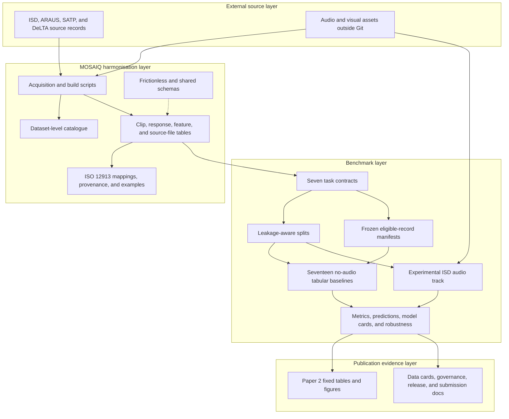

# MOSAIQ repository architecture and audit

Last audited: 4 August 2026

## Audit verdict

The repository is internally consistent as a MOSAIQ `0.1.0-dev` benchmark
candidate. The catalogue, four harmonised dataset packages, seven task
contracts, released splits, frozen manifests, tabular baselines, robustness
outputs, Paper 2 evidence, and experimental ISD audio outputs all pass their
current validators.

This does not make the repository a public MOSAIQ-v1.0 release. Rights review,
independent usability review, archival DOI/release creation, reviewer access,
and co-author review remain external release gates.

## System architecture

## Component map

| Area | Purpose | Current evidence |
| --- | --- | --- |
| `catalogue/` | One dataset-level inventory across the source collections | Frictionless-valid catalogue package |
| `datasets/` | Harmonised clip-, response-, feature-, and source-file tables | ISD, ARAUS, SATP, and DeLTA packages validate |
| `shared_schemas/` | Reusable field and schema-level harmonisation contracts | Referenced by packages and semantic validator |
| `mappings/` and `examples/` | Explicit source-to-MOSAIQ semantics and provenance | ISD and ARAUS examples validate with zero warnings |
| `benchmark/configs/` | Machine-readable prediction-task definitions | Seven task contracts validate against their schema |
| `benchmark/splits/` | Versioned partition assignments with leakage controls | Split version `0.1.0` validates for all four datasets |
| `benchmark/manifests/` | Frozen eligible IDs and source-row hashes | Eleven task/dataset manifests and checksums |
| `benchmark/results/` | Reproducible no-audio baseline outputs | 17 experiments and 498 metric rows validate |
| `benchmark/robustness/` | Stability, uncertainty, comparisons, and calibration | Five-seed and bootstrap outputs validate |
| `benchmark/audio/` | Separate experimental ISD waveform track | 820 usable clips and 2,988 held-out predictions validate |
| `papers/` | Immutable manuscript-facing evidence | 12 tables, 6 figures, and 23 manifested files validate |
| `tests/` and CI | Regression and release-contract checks | 24 unit tests plus package/output validators |

## Verification results

| Check | Result |
| --- | --- |
| Python unit tests | PASS: 24/24 |
| Python compilation | PASS for `scripts/` and `tests/` |
| Catalogue and four dataset packages | PASS: all resources `VALID` |
| Schema-level harmonisation | PASS: 2 records, 2 mappings, 0 warnings, 0 errors |
| FeatureRecord linkage | PASS: ISD and ARAUS placeholder records |
| Benchmark task contracts | PASS: 7 tasks |
| Leakage-aware split validation | PASS: ISD, ARAUS, SATP, and DeLTA |
| Submission contract | PASS: empty template accepted in template mode |
| Frozen benchmark report | PASS: 47 checks, 2 documented warnings, 0 failures |
| Tabular baseline outputs | PASS: 17 experiments, 498 metric rows |
| Robustness outputs | PASS: 3 models x 5 seeds plus bootstrap/calibration checks |
| Paper 2 fixed outputs | PASS: 12 tables, 6 figures, 23 files |
| Experimental ISD audio outputs | PASS with documented incomplete-mapping warnings |
| YAML and JSON syntax | PASS: all repository documents parsed |
| Secret-pattern scan | PASS: no credential-like strings found |
| Correctness lint | PASS after removal of four unused definitions/imports |
| Generated-output determinism | PASS with fixed timestamps, stable validation summaries, and single-worker estimators |

## Important boundaries

- The core `0.1.0-dev` benchmark is tabular and does not distribute raw audio
  or visual media.
- CLIP and CitySeg are supported as optional visual FeatureRecord types, but
  the current benchmark freeze has zero released visual-feature coverage.
- Psychoacoustic values used by current baselines remain clip-level tabular
  predictors; they are not part of the visual FeatureRecord layer.
- The experimental ISD audio manifest contains 1,021 mapped rows, of which 820
  are usable. Missing, unmatched, ambiguous, and duplicate cases remain
  explicit rather than being silently discarded.
- Raw media, source archives, and fitted model artefacts are excluded from Git.
- RDR package builders and validators depend on private external package
  directories and were not reconstructed during this repository-only audit.
- CitySeg can ingest precomputed summaries; direct HDF5 mask aggregation is
  still marked as a future implementation.

## Reproduction entry points

Use `docs/reproduce_benchmark.md` for the frozen no-audio workflow and
`benchmark/audio/README.md` for the experimental ISD audio workflow. CI mirrors
the repository-contained validation path in `.github/workflows/validate.yml`.
